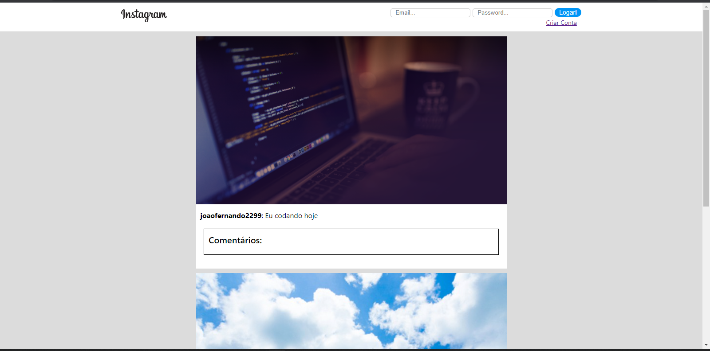
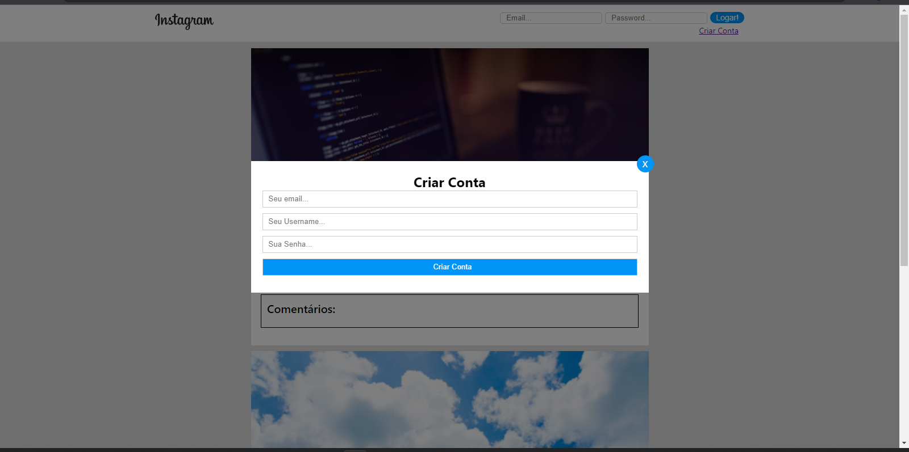
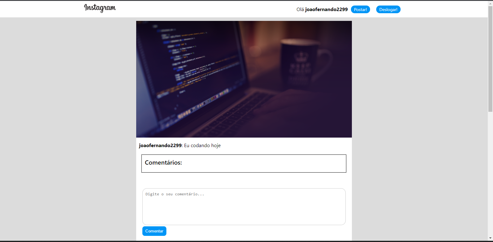
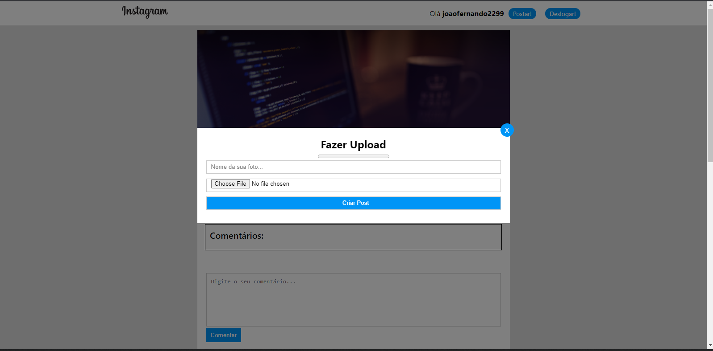

# Instagram clone

 
 

Projeto desenvolvido no curso de JavaScript da DankiCode

Tecnologias utilizadas:
 - Firebase 
 - React 
 - CSS 
 - JavaScript 

Esse projeto foi desenvolvido com o intuito de aprimorar minhas habilidades com JS, Firebase e com o React e o intuito de cópia foi da rede social Instagram

Você pode acessar o site pelo link: https://instagram-clone-da5a2.firebaseapp.com/